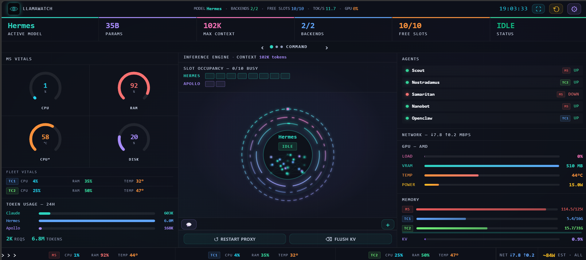
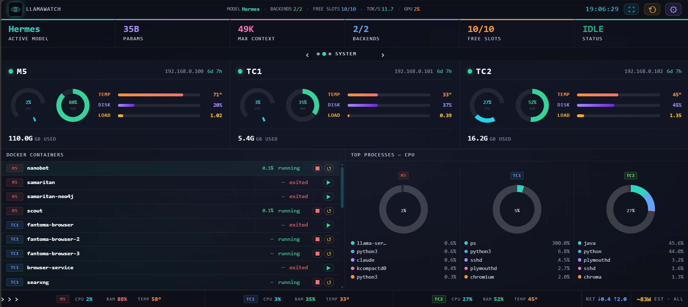

# llamawatch

[](https://www.gnu.org/licenses/agpl-3.0)
[](https://www.python.org/downloads/)
[]()




A self-hosted ops dashboard for people who run their own LLMs. Install with pip, point it at your llama.cpp or Ollama server, and get a browser-based control surface for everything: model health, slot occupancy, GPU stats, inference speed, your whole fleet of machines, Docker containers, a terminal, and chat — in one dense screen.

It fills a gap between chat UIs (great chat, no hardware monitoring) and infrastructure tools like Grafana (powerful, but a full Prometheus stack to set up). llamawatch is one command to install and one to run.

## Quick Start

```bash
git clone https://github.com/Huzy85/llamawatch.git
cd llamawatch
pip install .
llamawatch init        # scans your machine for LLM backends, GPU, services
llamawatch             # starts the dashboard
```

> Not on PyPI yet — install from source as above. A `pip install llamawatch` release will follow.

Open `http://localhost:8400/studio` in your browser. That's it.

On first open, the settings panel guides you: add your LLM backend, add the machines you want to monitor, and (if it's reachable on your network) set a password. Everything else is optional.

**Security note:** the dashboard can run shell commands and control Docker. When you enable a password (Settings → General), those actions require a valid session. With **no password**, they're restricted to a **direct localhost connection only**.

Two ways to leave that door open — both need a password first:

- **Binding to the network** (`0.0.0.0`) so another device can reach it.
- **Putting it behind a reverse proxy or tunnel** (nginx, Caddy, Cloudflare Tunnel, Tailscale Funnel). The proxy connects from `127.0.0.1`, so to the app every proxied request *looks* local. llamawatch detects the forwarding headers a proxy adds and treats those requests as remote — so with no password, a proxied request is refused rather than silently trusted. Set a password from a genuine localhost session (on the machine, or over an SSH tunnel) before exposing it this way.

## The Dashboard

llamawatch presents one dense control surface — **Studio** — as a three-view carousel. Swipe, use the arrow keys, or click the dots to move between views. A persistent status strip (6 live KPI tiles) and fleet vitals bar stay visible across all three. A full-screen button in the top-right scales the dashboard to fill your monitor.

| View | What it shows |
|------|--------------|
| **Command** | The inference engine at a glance — active model name, slot occupancy pips, an animated status orb (idle / generating / swapping, with step-by-step swap progress), live system gauges (CPU/RAM/temp/disk), real-time inference speed (tokens/s, latency percentiles), network throughput, GPU utilisation/VRAM, per-machine memory, background agent status, and **quick-action buttons**. |
| **System** | Hardware for every machine in your fleet — CPU and RAM gauges, temperature/disk/load bars, Docker containers with start/stop/restart, top-process breakdowns, and anomaly alerts. |
| **Knowledge** | Optional data sources — an articles/news feed, an interactive predictions world map, your RAG knowledge base, a markdown docs browser, and file upload/download. Each section appears only if you've configured its source. |

**Quick-action buttons** are one-click shell commands you define in Settings → Studio. Give each button a label, icon, and shell command — anything from restarting a service to running a script — and it appears as a button on the Command view. All actions are gated by the same auth/localhost rule as the rest of the dashboard.

**Chat panel** — a floating window (minimises to a tab in the terminal bar, not a fixed sidebar) to talk to your models. Pick any configured backend, stream replies, toggle optional SearXNG web-search, attach files (text, PDF, Word), and watch a live context-usage meter warn as you approach the model's limit. The full conversation history is sent every turn; swapping models hands the history to the new one.

**Terminal** — a floating in-browser PTY connected directly to the dashboard host. Opens as a floating window alongside chat; both can be minimised to tabs and reopened without losing state.

Every view and panel can be **shown or hidden** from Settings → Studio. The layout is fixed and tuned for density — no manual dragging or resizing.

## Monitoring Multiple Machines

llamawatch monitors a whole fleet, not just the box it runs on. In **Settings → Fleet**, add each machine with a name, IP and SSH user (key-based SSH access required from the dashboard host). Mark the box llamawatch runs on as "This machine" — read locally, no SSH. Each machine gets a colour and optional idle/max wattage figures.

With wattage configured, llamawatch estimates live power draw from CPU load (linear interpolation between idle and max watts) and shows a running cost estimate based on your per-kWh rate. The 24-hour token usage panel breaks down output tokens by backend so you can see how hard each machine is working.

**Sweet spot: 4–5 machines** — the whole fleet fits on screen at a glance. More work fine (the System view scrolls sideways); a single machine works too (the layout centres and adapts).

## Browser-Based Settings

Click the gear icon (top right) to open settings. Five tabs, each with inline help:

- **Studio** — show/hide views and panels, toggle voice control, define quick-action buttons
- **Fleet** — your machines (local + remote) and the background agents/containers to track
- **Backends** — add/remove LLM servers, test connections, set friendly model display names
- **Services** — systemd units / Docker containers to show health for
- **General** — dashboard name, password auth, port, sensor scan, chat system prompt

Changes apply immediately (except port/host, which need a restart). Secrets (passwords, API keys) are written to `config.local.json` encrypted with a local key rather than in plaintext, and the browser never stores them. The key (`secret.key`) sits next to the config by default, so this guards against casual exposure — sharing the file, committing it, a stray backup — not someone who can already read your home directory. Set `LLAMAWATCH_SECRET_KEY` to keep the key separate from the data.

## Supported Backends

| Backend | How it connects |
|---------|----------------|
| **llama.cpp** (`llama-server`) | HTTP API — health, model info, slots, Prometheus metrics |
| **Ollama** | HTTP API — model list, health, completion timings |
| **Any OpenAI-compatible server** | Standard `/v1/models` and `/v1/chat/completions` |

Add multiple backends; the dashboard shows them all.

## Optional Integrations

All off by default — configured per-install, and their panels stay hidden until set up:

- **Predictions** — a PostgreSQL source of forecasts (interactive world map). Set `predictions_dsn` in Settings → General to a PostgreSQL connection string. Requires the `[predictions]` extra (`pip install ".[predictions]"`). Expected table:
  ```sql
  CREATE TABLE predictions (
      id UUID PRIMARY KEY,
      prediction_text TEXT,
      domain TEXT,
      geography TEXT,
      timeframe TIMESTAMPTZ,
      confidence_score NUMERIC,
      verified BOOLEAN,
      generated_at TIMESTAMPTZ,
      brief TEXT,
      reasoning TEXT
  );
  ```
- **Articles feed** — a SQLite articles/news DB. Set `press_room_db` in Settings → General to the path of your SQLite file. Expected table:
  ```sql
  CREATE TABLE articles (
      id TEXT PRIMARY KEY,
      topic_key TEXT,
      title TEXT,
      hook TEXT,
      analysis TEXT,
      predictions TEXT,
      signal_card TEXT,
      topic_display TEXT,
      tier INTEGER DEFAULT 0,
      is_read INTEGER DEFAULT 0,
      created_at TEXT,
      last_written_at TEXT
  );
  ```
- **Web search** — a SearXNG instance
- **Knowledge base** — ChromaDB + an optional RAG hub
- **Docs browser** — markdown files from paths you choose
- **File transfer** — upload to an inbox, download from a share folder

## Auto-Discovery

`llamawatch init` scans your system and writes a config:

- Probes common ports (8080, 8081, 11434, …) for LLM servers
- Detects GPU type and VRAM (AMD via sysfs, NVIDIA via nvidia-smi, Apple via system profiler)
- Finds LLM-related systemd services and running Docker containers
- Detects temperature sensors

```
llamawatch init — scanning your system...

Found:
  ✓ llama.cpp on localhost:8080 (model: your-model)
  ✓ NVIDIA RTX 4090 (24GB VRAM)
  ✓ 3 Docker containers running

Config written to ~/.config/llamawatch/config.local.json
Run 'llamawatch' to start the dashboard.
```

Remote fleet machines are added afterwards in Settings → Fleet (init configures the local machine and backends).

## Configuration

Two-file system:

- `config.json` — ships with the package; clean defaults, never modified by the UI
- `config.local.json` — your overrides, created by `llamawatch init` or the settings modal (gitignored if you clone the repo)

The settings modal writes to `config.local.json`. Changes take effect immediately (except port/host).

### Environment Variables

| Variable | Default | Description |
|----------|---------|-------------|
| `LLAMAWATCH_PORT` | `8400` | Dashboard port |
| `LLAMAWATCH_HOST` | `127.0.0.1` | Bind address (set `0.0.0.0` + a password for network access) |
| `LLAMAWATCH_AUTH` | `false` | Enable password auth |

### CLI Flags

```bash
llamawatch --port 9000        # override port
llamawatch --host 127.0.0.1   # bind to localhost only
```

## Auth

Off by default. To enable: Settings → General → "Require password", set a password. Sessions use secure HTTP-only cookies (expiry configurable, default 7 days) and survive restarts. Passwords are Argon2id-hashed. When auth is off, dangerous actions (shell commands, Docker controls) are restricted to a direct localhost connection.

"Localhost" means a genuine loopback client. A request relayed through a reverse proxy or tunnel arrives from `127.0.0.1` but carries forwarding headers (`X-Forwarded-For`, `Forwarded`, `CF-Connecting-IP`, and similar); llamawatch treats those as remote, so a proxy does not count as localhost. The net effect: if anything other than a direct localhost client can reach the dashboard, you must set a password — there is no configuration in which the terminal and shell actions are reachable off-box without one.

If the dashboard binds to `0.0.0.0` and auth is off, the settings panel warns you that it's open to your network.

## PWA / Mobile

llamawatch is an installable Progressive Web App. On your phone, open the dashboard and "Add to Home Screen" — it runs standalone with its own icon and uses your configured dashboard name. The layout reflows for small screens; a header button clears the cache and reloads after an update.

## Platform Support

llamawatch has two sides with different requirements: the **server** you run on the machine with your models, and the **dashboard** you open in a browser.

**The dashboard** is a web app. Open it from any device with a browser — Windows, macOS, Linux, Android, iOS. On a phone, add it to your home screen and it runs like a native app. Nothing to install on the device you view it from.

**The server** runs where your models run:

| Platform | Running the server |
|----------|--------------------|
| Linux | Full support — GPU detection (AMD via sysfs, NVIDIA via nvidia-smi), all collectors |
| macOS (Intel + Apple Silicon) | Works; GPU stats not available (no sysfs), temperature sensors limited |
| Windows | Not supported directly yet — run the server under WSL2 or on a Linux/macOS host, then open the dashboard from Windows |

Python 3.10+ required to run the server.

## Tech Stack

- **Backend**: Python, FastAPI, uvicorn
- **Frontend**: Vanilla JavaScript — zero build step, no npm, no bundler
- **Live data**: Server-Sent Events; WebSocket for terminal and chat
- **Terminal**: xterm.js (vendored)
- **Auth**: Argon2id + session cookies
- **Secrets**: Fernet-encrypted with a local key (`secret.key`, or `LLAMAWATCH_SECRET_KEY`). The key sits beside the config by default — this protects against casual exposure (sharing/backups), not an attacker who can read your home directory

All frontend dependencies are vendored. `pip install .` is all you need to run. Optional extras: `pip install ".[predictions]"` (PostgreSQL predictions panel) and `pip install ".[documents]"` (PDF/Word chat attachments). Remote-fleet monitoring uses your system `ssh` client — no extra needed.

## Development

```bash
git clone https://github.com/Huzy85/llamawatch.git
cd llamawatch
pip install -e ".[test]"
python -m llamawatch --port 8400
```

### Running Tests

```bash
python -m pytest -q
```

The test suite covers:

- **Config** — two-file merge, hot-reload, credential redaction, env-var overrides, deep merge
- **Adapters** — llama.cpp, Ollama, and OpenAI-compatible backend adapters
- **Collectors** — GPU, logs viewer, resource hogs, inference speed and latency percentiles, power estimation, network speed, email (IMAP paths, RFC 2047, PGP skip, cache TTL), model status (swap-lock parsing, KV cache, generating detection), slots (multi-backend), token usage (SQLite DB, /metrics snapshots, Claude Code JSONL), fleet (local + SSH remotes), anomaly correlation, auto-detect
- **API & routing** — settings (round-trip, secret encryption, credential redaction), actions, Docker (local + remote SSH injection hardening), connections CRUD, knowledge search endpoints, press-room search (LIKE wildcard handling), SSE streaming, smoke/wiring regression
- **Security** — localhost gate, action gating, WebSocket auth, secrets vault + credential encryption, auth hashing, session persistence (corrupt store, expiry, save failure), docs path traversal blocked, symlink-outside-root blocked
- **Hub & registry** — WebSocket hub (compute\_diff: non-serialisable values, key ordering, NaN), collector registry (multi-instance, config schemas), adapter registry rebuild
- **Infrastructure** — audit log (corrupt/CRLF files, chmod failure), request log (200-char truncation, multi-file ordering, write failure), topology, init CLI, connections registry (all six types, secret field coverage), widget genericisation, boards layout

The Studio frontend is verified manually (no automated UI tests yet).

### Project Structure

```
llamawatch/
├── llamawatch/
│   ├── server.py            # FastAPI app, all HTTP/WS routes
│   ├── config.py            # Two-file config with hot-reload + fleet helpers
│   ├── auth.py              # Argon2id auth, disk-persisted sessions
│   ├── auto_detect.py       # System scanning for `init`
│   ├── sse.py               # Server-Sent Events stream
│   ├── adapters/            # llama.cpp / Ollama / OpenAI-compatible
│   ├── collectors/          # Data collectors (one per data type, config-driven)
│   └── static/
│       ├── studio.html      # The dashboard
│       ├── studio.js        # Studio logic (views, fleet rendering, live data)
│       ├── settings.js      # Settings modal (5 tabs)
│       └── vendor/          # xterm.js (vendored)
├── tests/                   # pytest suite
├── config.json              # Default config template (no personal data)
└── pyproject.toml
```

### Architecture Notes

Studio is a fixed-layout dashboard fed by Server-Sent Events. Each data type has a collector under `collectors/` that returns a dict; the SSE hub streams these to the browser, where `studio.js` updates the matching panel. Per-machine UI (cards, bars, donuts) is generated from your `fleet` config, so any number of machines renders correctly. Collectors read all site-specific values (hosts, paths, model names, service maps) from config — nothing is hardcoded.

## Contributing

1. Fork the repo
2. Create a feature branch (`git checkout -b feat/your-feature`)
3. Write tests for backend changes
4. Open a pull request

Bug reports and feature requests: [Issues](https://github.com/Huzy85/llamawatch/issues)

## License

Licensed under AGPL-3.0-or-later. See [LICENSE](LICENSE).

Built by [Steam Vibe Ltd](https://steamvibe.co.uk), Holyhead, North Wales.
