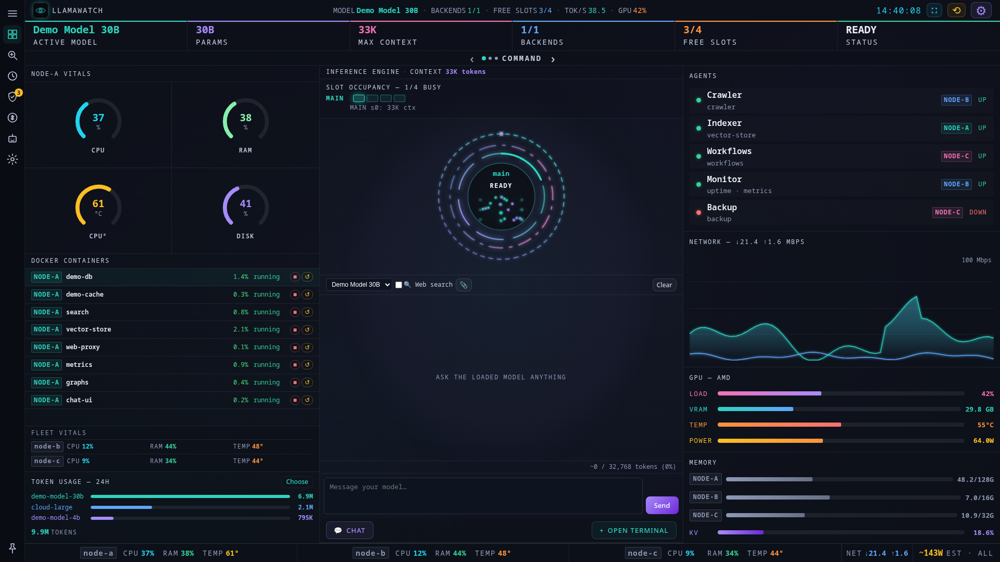
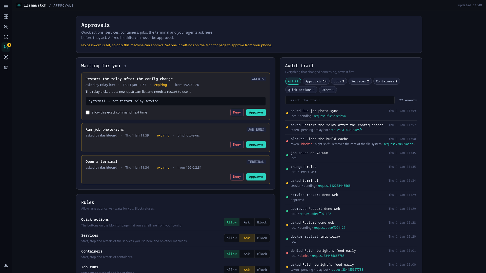
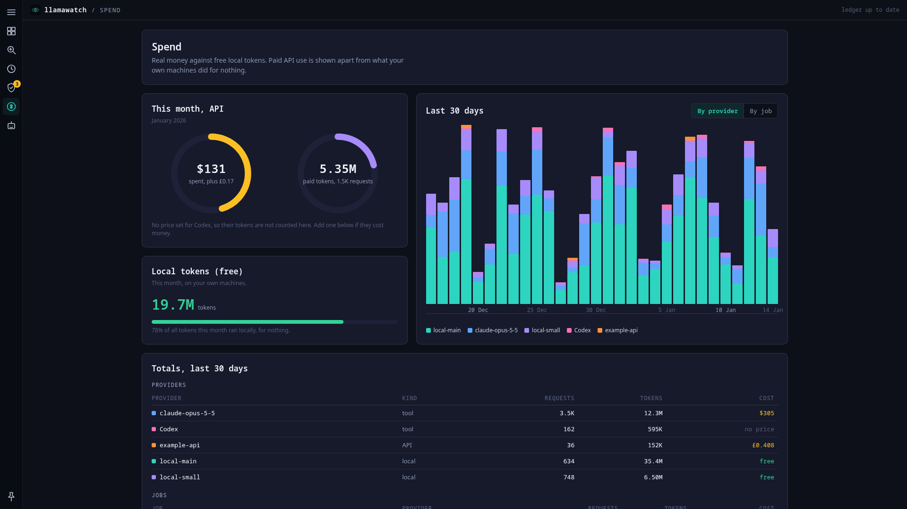
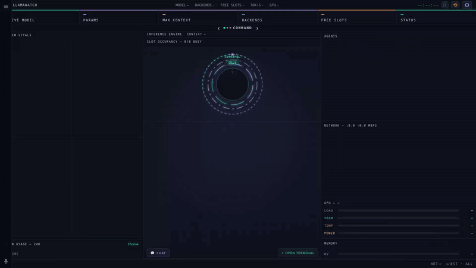

# llamawatch

[](https://www.gnu.org/licenses/agpl-3.0)
[](https://www.python.org/downloads/)
[]()



<p>


</p>

_Screenshots use the built-in demo data (`--sample`)._

### See it in action



A tour of every sidebar page: Monitor, Research, Jobs, Approvals, Spend and Agents, all on made-up demo data. [Download the full-quality video (MP4, 11 MB)](https://github.com/Huzy85/llamawatch/raw/main/docs/demo.mp4).

A self-hosted ops dashboard for people who run their own LLMs. Install with pip, point it at your llama.cpp or Ollama server, and get a browser-based control surface for everything: model health, slot occupancy, GPU stats, inference speed, your whole fleet of machines, Docker containers, a terminal, and chat — in one dense screen.

It fills a gap between chat UIs (great chat, no hardware monitoring) and infrastructure tools like Grafana (powerful, but a full Prometheus stack to set up). llamawatch is one command to install and one to run.

Besides the dashboard, five pages cover the rest of running models at home: cited **Research** with any model, every scheduled **Job** in one list, an **Approvals** gate for anything that changes your machines, a **Spend** ledger of paid API use against free local tokens, and a replay of what your coding **Agents** did.

## Quick Start

```bash
git clone https://github.com/Huzy85/llamawatch.git
cd llamawatch
python3 -m venv .venv            # a private folder for llamawatch's packages
.venv/bin/pip install .
.venv/bin/llamawatch init        # scans your machine for LLM backends, GPU, services
.venv/bin/llamawatch             # starts the dashboard
```

> Not on PyPI yet, so install from source as above. A `pip install llamawatch` release will follow.

Open `http://localhost:8400/studio` in your browser.

**New to this? Read the [setup guide](docs/SETUP.md).** It goes step by step from installing Python to every optional feature, with a check after each step, a troubleshooting list and a ready-made prompt for your AI assistant.

Want to look around first? `.venv/bin/llamawatch --sample tests/ui/fixtures/snapshot.json` serves made-up demo data and refuses every write.

On first open, the settings panel guides you: add your LLM backend, add the machines you want to monitor, and (if it's reachable on your network) set a password. Everything else is optional.

**Security note:** the dashboard can run shell commands and control Docker. When you enable a password (Settings → General), those actions require a valid session. With **no password**, they're restricted to a **direct localhost connection only**.

Two ways to leave that door open — both need a password first:

- **Binding to the network** (`0.0.0.0`) so another device can reach it.
- **Putting it behind a reverse proxy or tunnel** (nginx, Caddy, Cloudflare Tunnel, Tailscale Serve or Funnel). The proxy connects from `127.0.0.1`, so to the app every proxied request *looks* local. llamawatch detects the forwarding headers a proxy adds and treats those requests as remote — so with no password, a proxied request is refused rather than silently trusted. Set a password from a genuine localhost session (on the machine, or over an SSH tunnel) before exposing it this way.

## The Monitor Page

The main page (`/studio`) is one dense control surface laid out as three views: Command, System and Knowledge. On a normal screen it shows one view at a time; on an ultrawide it shows two or three side by side. Dials and text are sized from the space they have, from a phone up to a 32:9 monitor.

A side rail on the left (a bottom bar on phones) moves between Monitor and the other pages. Hover to open it, or pin it open.

Within the Monitor page, the views work as a carousel. Swipe, use the arrow keys, or click the dots to move between views. A persistent status strip (6 live KPI tiles) and fleet vitals bar stay visible across all three. A full-screen button in the top-right scales the dashboard to fill your monitor.

| View | What it shows |
|------|--------------|
| **Command** | The inference engine at a glance — active model name, slot occupancy pips, an animated status orb (idle / generating / swapping, with step-by-step swap progress), live system gauges (CPU/RAM/temp/disk), real-time inference speed (tokens/s, latency percentiles), network throughput, GPU utilisation/VRAM, per-machine memory, background agent status, and **quick-action buttons**. |
| **System** | Hardware for every machine in your fleet — CPU and RAM gauges, temperature/disk/load bars, Docker containers with start/stop/restart, top-process breakdowns, and anomaly alerts. |
| **Knowledge** | Optional data sources — an articles/news feed, an interactive predictions world map, your RAG knowledge base, a markdown docs browser, and file upload/download. Each section appears only if you've configured its source. |

**Quick-action buttons** are one-click shell commands you define in Settings → Studio. Give each button a label, icon, and shell command — anything from restarting a service to running a script — and it appears as a button on the Command view. All actions are gated by the same auth/localhost rule as the rest of the dashboard.

**Chat panel** — a floating window (minimises to a tab in the terminal bar, not a fixed sidebar) to talk to your models. Pick any configured backend, stream replies, toggle optional SearXNG web-search, attach files (text, PDF, Word), and watch a live context-usage meter warn as you approach the model's limit. The full conversation history is sent every turn; swapping models hands the history to the new one.

**Terminal** — a floating in-browser PTY connected directly to the dashboard host. Opens as a floating window alongside chat; both can be minimised to tabs and reopened without losing state.

Every view and panel can be **shown or hidden** from Settings → Studio. The layout is fixed and tuned for density — no manual dragging or resizing.

**Bigger screens.** On screens 1025px wide and 900px tall or more, the Command view keeps a chat open under the status ring. At 1700px and wider the dashboard fills the extra room with more information, including a temperature **History** panel on the System view. It reads a JSON-lines log of sensor temperatures from `temp_log_path` (default `~/logs/temp-monitor.jsonl`, lines like `{"ts": "2026-01-01T12:00:00+00:00", "temps": {"cpu": 54.3}}`); without a log the panel stays empty.

## The Other Pages

All five sit behind the same password and localhost rules as the dashboard.

| Page | What it does |
|------|--------------|
| **Research** (`/research`) | Ask a question, pick any configured model (local, or an online API you add from the page) and get a cited report: the answer, key findings with sources and confidence, for and against, what could not be verified, and follow-up questions. Two depths. A run carries on if you leave the page. Reports print to A4, save as PDF, and export as Markdown or HTML. Needs `pip install ".[research]"` and `playwright install chromium`; web search uses SearXNG by default (Brave, Tavily or DuckDuckGo also work). |
| **Jobs** (`/jobs`) | Every systemd user timer, cron line and research run on the machine in one list, failed ones first, with recent logs. Add, edit and delete your own timers from the page. |
| **Approvals** (`/approvals`) | Quick actions, services, containers, jobs, the terminal and agents ask here before they act. Set Allow / Ask / Block per kind. A built-in blocklist (and your own patterns) can never be approved. Agents and scripts on other machines ask with a requester token sent as `X-Llamawatch-Token`; the token can ask and poll, never approve. An optional shell line notifies you when something waits, and every change lands in a searchable audit trail. |
| **Spend** (`/spend`) | A daily ledger of paid API spend next to the free tokens your own machines produced, by provider or by job. You type in the prices; nothing is guessed. Connect your own OpenAI, Anthropic, DeepSeek and other accounts to include spend from other apps ([which providers](docs/SPEND-PROVIDERS.md)). |
| **Agents** (`/agents`) | What is running now, plus a replay of each past run (Claude Code sessions, Codex rollouts, research runs, and the agents you list in config): the steps, how long each took and the tokens used. Read only. |

## Monitoring Multiple Machines

llamawatch monitors a whole fleet, not just the box it runs on. In **Settings → Fleet**, add each machine with a name, IP and SSH user (key-based SSH access required from the dashboard host). Mark the box llamawatch runs on as "This machine" — read locally, no SSH. Each machine gets a colour and optional idle/max wattage figures.

With wattage configured, llamawatch estimates live power draw in watts from CPU load (linear interpolation between idle and max watts), plus the GPU's measured draw where the driver reports it. The 24-hour token usage panel breaks down output tokens by backend so you can see how hard each machine is working.

**Sweet spot: 4–5 machines** — the whole fleet fits on screen at a glance. More work fine (the System view scrolls sideways); a single machine works too (the layout centres and adapts).

## Browser-Based Settings

Click the gear icon (top right) to open settings. Five tabs, each with inline help:

- **Studio** — show/hide views and panels, toggle voice control, define quick-action buttons
- **Fleet** — your machines (local + remote) and the background agents/containers to track
- **Backends** — add/remove LLM servers, test connections, set friendly model display names, chat system prompt
- **Services** — systemd units / Docker containers to show health for
- **General** — dashboard name, password auth, port and host, SearXNG web search, sensor scan

Changes apply immediately (except port/host, which need a restart). Secrets (passwords, API keys) are written to `config.local.json` encrypted with a local key rather than in plaintext, and the browser never stores them. The key (`secret.key`) sits next to the config by default, so this guards against casual exposure — sharing the file, committing it, a stray backup — not someone who can already read your home directory. Set `LLAMAWATCH_SECRET_KEY` to keep the key separate from the data.

## Supported Backends

| Backend | How it connects |
|---------|----------------|
| **llama.cpp** (`llama-server`) | HTTP API — health, model info, slots, Prometheus metrics |
| **Ollama** | HTTP API — model list, health, completion timings |
| **Any OpenAI-compatible server** | Standard `/v1/models` and `/v1/chat/completions` |

Add multiple backends; the dashboard shows them all.

## Optional Integrations

All off by default, and their panels stay hidden until set up. Most are set in `config.local.json`; the [setup guide](docs/SETUP.md#level-6-optional-extras) has the exact lines to add.

- **Predictions** — a PostgreSQL source of forecasts (interactive world map). Set `predictions_dsn` in `config.local.json` to a PostgreSQL connection string. Requires the `[predictions]` extra (`pip install ".[predictions]"`). Expected table:
  ```sql
  CREATE TABLE predictions (
      id UUID PRIMARY KEY,
      prediction_text TEXT,
      domain TEXT,
      geography TEXT,
      timeframe TIMESTAMPTZ,
      confidence_score NUMERIC,
      verified BOOLEAN,
      generated_at TIMESTAMPTZ,
      brief TEXT,
      reasoning TEXT
  );
  ```
- **Articles feed** — a SQLite articles/news DB. Set `press_room_db` in `config.local.json` to the path of your SQLite file. Every column below must exist, or the list stays empty. Expected table:
  ```sql
  CREATE TABLE articles (
      id TEXT PRIMARY KEY,
      topic_key TEXT,
      title TEXT,
      hook TEXT,
      analysis TEXT,
      predictions TEXT,
      signal_card TEXT,
      topic_display TEXT,
      tier INTEGER DEFAULT 0,
      is_read INTEGER DEFAULT 0,
      created_at TEXT,
      last_written_at TEXT
  );
  ```
- **Web search** — a SearXNG instance with JSON output turned on (Settings → General)
- **Knowledge base** — ChromaDB 1.0 or newer, plus an optional search hub
- **Docs browser** — markdown files from the folders in `docs_roots`
- **File transfer** — upload to an inbox, download from a share folder

## Auto-Discovery

`llamawatch init` scans your system and writes a config:

- Probes common ports (8080, 8081, 11434, …) for LLM servers
- Detects GPU type and VRAM (AMD via sysfs, NVIDIA via nvidia-smi, Apple via system profiler)
- Finds LLM-related systemd services and running Docker containers
- Detects temperature sensors

```
llamawatch init — scanning your system...

Found:
  ✓ llama.cpp on localhost:8080 (model: your-model)
  ✓ NVIDIA RTX 4090 (24GB VRAM)
  ✓ 3 Docker containers running

Config written to ~/.config/llamawatch/config.local.json
Run 'llamawatch' to start the dashboard.
```

Remote fleet machines are added afterwards in Settings → Fleet (init configures the local machine and backends).

## Configuration

Two-file system:

- `config.json` — ships with the package; clean defaults, never modified by the UI
- `config.local.json` — your overrides, created by `llamawatch init` or the settings modal (gitignored if you clone the repo)

The settings modal writes to `config.local.json`. Changes take effect immediately (except port/host). Edits you make to the file by hand are read at start-up, so restart after editing.

### Environment Variables

| Variable | Default | Description |
|----------|---------|-------------|
| `LLAMAWATCH_PORT` | `8400` | Dashboard port |
| `LLAMAWATCH_HOST` | `127.0.0.1` | Bind address (set `0.0.0.0` + a password for network access) |
| `LLAMAWATCH_AUTH` | `false` | Enable password auth |

### CLI Flags

```bash
llamawatch --port 9000        # override port
llamawatch --host 127.0.0.1   # bind to localhost only
```

## Auth

Off by default. To enable: Settings → General → "Require password", set a password. Sessions use secure HTTP-only cookies (expiry configurable, default 7 days) and survive restarts. Passwords are Argon2id-hashed. When auth is off, dangerous actions (shell commands, Docker controls) are restricted to a direct localhost connection.

"Localhost" means a genuine loopback client. A request relayed through a reverse proxy or tunnel arrives from `127.0.0.1` but carries forwarding headers (`X-Forwarded-For`, `Forwarded`, `CF-Connecting-IP`, and similar); llamawatch treats those as remote, so a proxy does not count as localhost. The net effect: if anything other than a direct localhost client can reach the dashboard, you must set a password — there is no configuration in which the terminal and shell actions are reachable off-box without one.

If the dashboard binds to `0.0.0.0` and auth is off, the settings panel warns you that it's open to your network.

## PWA / Mobile

llamawatch is an installable Progressive Web App. To reach it away from home without opening anything to the internet, use Tailscale Serve (steps in [docs/SETUP.md](docs/SETUP.md#option-c-open-it-from-anywhere-with-tailscale)). On your phone, open the dashboard and "Add to Home Screen" — it runs standalone with its own icon and uses your configured dashboard name. The layout reflows for small screens; a header button clears the cache and reloads after an update.

## Platform Support

llamawatch has two sides with different requirements: the **server** you run on the machine with your models, and the **dashboard** you open in a browser.

**The dashboard** is a web app. Open it from any device with a browser — Windows, macOS, Linux, Android, iOS. On a phone, add it to your home screen and it runs like a native app. Nothing to install on the device you view it from.

**The server** runs where your models run:

| Platform | Running the server |
|----------|--------------------|
| Linux | Full support — GPU detection (AMD via sysfs, NVIDIA via nvidia-smi), all collectors |
| macOS (Intel + Apple Silicon) | Works; GPU stats not available (no sysfs), temperature sensors limited |
| Windows | Not supported directly yet — run the server under WSL2 or on a Linux/macOS host, then open the dashboard from Windows |

Python 3.10+ required to run the server.

## Tech Stack

- **Backend**: Python, FastAPI, uvicorn
- **Frontend**: Vanilla JavaScript — zero build step, no npm, no bundler
- **Live data**: Server-Sent Events; WebSocket for terminal and chat
- **Terminal**: xterm.js (vendored)
- **Auth**: Argon2id + session cookies
- **Secrets**: Fernet-encrypted with a local key (`secret.key`, or `LLAMAWATCH_SECRET_KEY`). The key sits beside the config by default — this protects against casual exposure (sharing/backups), not an attacker who can read your home directory

All frontend dependencies are vendored. `pip install .` is all you need to run. Optional extras: `pip install ".[predictions]"` (PostgreSQL predictions panel), `pip install ".[documents]"` (PDF/Word chat attachments) and `pip install ".[research]"` (the Research page; then run `playwright install chromium`).

Installing into its own virtual environment keeps llamawatch's web-framework versions separate from other Python apps on the machine:

```bash
python3 -m venv ~/.local/share/llamawatch/venv
~/.local/share/llamawatch/venv/bin/pip install .
~/.local/share/llamawatch/venv/bin/llamawatch
```

Remote-fleet monitoring uses your system `ssh` client, no extra needed.

## Development

```bash
git clone https://github.com/Huzy85/llamawatch.git
cd llamawatch
python3 -m venv .venv && . .venv/bin/activate
pip install -e ".[test]"
python -m llamawatch --port 8400
```

### Running Tests

```bash
python -m pytest -q          # unit and API tests (about 920)
```

Browser tests drive the real pages in headless Chromium against the demo data, at screen sizes from a phone to a 5120px ultrawide, and compare against reference screenshots in `tests/ui/reference/`:

```bash
pip install -e ".[test,ui]"
playwright install chromium
python -m pytest -m ui -q    # about 190 tests
LW_UPDATE_REFS=1 python -m pytest -m ui -k look   # rewrite the reference screenshots after a deliberate visual change
```

The test suite covers:

- **Config** — two-file merge, hot-reload, credential redaction, env-var overrides, deep merge
- **Adapters** — llama.cpp, Ollama, and OpenAI-compatible backend adapters
- **Collectors** — GPU, logs viewer, resource hogs, inference speed and latency percentiles, power estimation, network speed, email (IMAP paths, RFC 2047, PGP skip, cache TTL), model status (swap-lock parsing, KV cache, generating detection), slots (multi-backend), token usage (SQLite DB, /metrics snapshots, Claude Code JSONL), fleet (local + SSH remotes), anomaly correlation, auto-detect
- **API & routing** — settings (round-trip, secret encryption, credential redaction), actions, Docker (local + remote SSH injection hardening), connections CRUD, knowledge search endpoints, press-room search (LIKE wildcard handling), SSE streaming, smoke/wiring regression
- **Security** — localhost gate, action gating, WebSocket auth, secrets vault + credential encryption, auth hashing, session persistence (corrupt store, expiry, save failure), docs path traversal blocked, symlink-outside-root blocked
- **Hub & registry** — WebSocket hub (compute\_diff: non-serialisable values, key ordering, NaN), collector registry (multi-instance, config schemas), adapter registry rebuild
- **Pages** — research pipeline, web fetching and source trust, jobs (timers, cron, add/edit/delete), approvals (rules, blocklist, tokens, expiry), spend ledger, agent run replay, sample mode
- **Security patches** — cross-site write check, login throttle address handling, password changes, upload limits, terminal environment filter, secrets at rest
- **Infrastructure** — audit log (corrupt/CRLF files, chmod failure), request log (200-char truncation, multi-file ordering, write failure), topology, init CLI, connections registry (all six types, secret field coverage), widget genericisation, boards layout

- **Browser** (`-m ui`) — page layout at nine screen sizes, side rail, carousel and resize, chat dock, fill and fit, every new page, and look checks against reference screenshots

### Project Structure

```
llamawatch/
├── llamawatch/
│   ├── server.py            # FastAPI app setup
│   ├── config.py            # Two-file config with hot-reload + fleet helpers
│   ├── auth.py              # Argon2id auth, disk-persisted sessions
│   ├── auto_detect.py       # System scanning for `init`
│   ├── sse.py               # Server-Sent Events stream
│   ├── sample.py            # Demo-data mode (--sample)
│   ├── approvals.py         # Approval gate, rules, blocklist, tokens
│   ├── jobs.py / spend.py / spend_providers.py / agents.py
│   ├── research/            # Research pipeline (search, fetch, rank, write, verify)
│   ├── routes/              # HTTP and WebSocket routes, one file per area
│   ├── adapters/            # llama.cpp / Ollama / OpenAI-compatible
│   ├── collectors/          # Data collectors (one per data type, config-driven)
│   └── static/
│       ├── studio.html      # The Monitor page
│       ├── studio.js        # Monitor logic (views, fleet rendering, live data)
│       ├── layout.js        # Side rail and page sizing shared by every page
│       ├── settings.js      # Settings modal (5 tabs)
│       ├── research.* jobs.* approvals.* spend.* agents.*
│       └── vendor/          # xterm.js (vendored)
├── tests/                   # pytest suite; tests/ui = browser tests
├── docs/                    # research design notes, sample report, screenshots
├── config.json              # Default config template (no personal data)
└── pyproject.toml
```

### Architecture Notes

Studio is a fixed-layout dashboard fed by Server-Sent Events. Each data type has a collector under `collectors/` that returns a dict; the SSE hub streams these to the browser, where `studio.js` updates the matching panel. Per-machine UI (cards, bars, donuts) is generated from your `fleet` config, so any number of machines renders correctly. Collectors read all site-specific values (hosts, paths, model names, service maps) from config — nothing is hardcoded.

## Contributing

1. Fork the repo
2. Create a feature branch (`git checkout -b feat/your-feature`)
3. Write tests for backend changes
4. Open a pull request

Bug reports and feature requests: [Issues](https://github.com/Huzy85/llamawatch/issues)

## License

Licensed under AGPL-3.0-or-later. See [LICENSE](LICENSE).

Built by [Steam Vibe Ltd](https://steamvibe.co.uk), Holyhead, North Wales.
